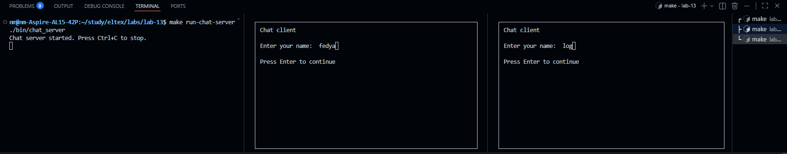
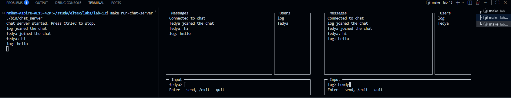

# 13 - Очереди сообщений

## Задание
1) Реализовать 2 программы, первая сервер, вторая клиент. Сервер создает
сегмент разделяемой памяти (достаточный для хранения сообщений) и
записывает сообщение виде строки “Hi!”, ждет ответа от клиента и
выводит на экран, удаляет сегмент разделяемой памяти. Клиент
подключается к сегменту разделяемой памяти и считывает сообщение от
сервера, выводит на экран, отвечает серверу сообщением виде строки
“Hello!”. Сделать это как для POSIX, так и для SYSTEM V стандартов

2) Написать 2 программы, первая сервер, вторая клиент. Сервер создает
сегмент разделяемой памяти для реализации чата с общей комнатой и
его задача уведомлять клиентов о появлении новых участников, о новых
сообщениях. Клиент подключается к сегменту разделяемой памяти,
созданному сервером, сообщает ему свое имя и получает в ответ все
сообщения в комнате. Далее может отправлять сообщения в общий чат.
Получение служебных сообщений от сервера (имена новых клиентов,
сообщения от других пользователей) и отправка сообщений в чат лучше
реализовать в разных потоках. Интерфейс клиента реализуем с помощью
библиотеки ncurses.

## Структура проекта

```text
lab-13/
├── include/
│   ├── chat.h       # Общие структуры и константы чата
│   └── chat_ui.h    # Интерфейс ncurses-части клиента
├── src/
│   ├── posix_server.c
│   ├── posix_client.c
│   ├── sysv_server.c
│   ├── sysv_client.c
│   ├── chat_server.c
│   ├── chat_client.c
│   └── chat_ui.c
└── Makefile
```

## Сборка

Собрать все программы:

```bash
make
```

Очистить бинарные файлы:

```bash
make clean
```

## Как сделано 1 задание
### POSIX
- Используются 2 очереди сообщений: `"/POSIX-Client"` для сообщения от сервера клиенту и `"/POSIX-Server"` для ответа клиента серверу.
- Сервер создает обе очереди, отправляет клиенту `Hi!`, ждет ответ `Hello!`, после успешного обмена закрывает и удаляет очереди.
- Клиент открывает уже созданные сервером очереди, читает сообщение сервера, выводит его и отправляет ответ.

### System V
- Используется одна очередь сообщений.
- Сервер отправляет сообщение типа `1`, клиент читает его и отвечает сообщением с типом, равным `pid` сервера.

## Пример вывода
```text
$ make run-posix-server
Client message: Hello!

$ make run-posix-client
Server message: Hi!
```

```text
$ make run-sysv-server
Client message: Hello!

$ make run-sysv-client
Server message: Hi!
```

## Как реализовано 2 задание

Во 2 задании реализован общий чат с интерфейсом на `ncurses`.

Кратко по логике:

- сервер работает на POSIX;
- у сервера есть одна общая очередь для входящих сообщений от клиентов;
- у каждого клиента есть своя очередь для получения сообщений от сервера;
- клиент после запуска вводит имя и отправляет серверу команду входа;
- сервер добавляет клиента в список активных пользователей;
- сервер рассылает всем служебные сообщения о входе, выходе и новые сообщения;
- клиент получает сообщения в отдельном потоке;
- основной поток клиента отвечает за интерфейс и ввод текста.

Почему у каждого клиента своя очередь:

- сервер может отправить одно и то же сообщение каждому клиенту отдельно;
- все пользователи видят одинаковую историю сообщений;
- удобно делать рассылку всем участникам чата.

## Интерфейс клиента

Клиентский интерфейс разделён на 3 области:

- слева окно сообщений;
- справа список пользователей;
- снизу поле ввода сообщения.

Файлы разделены так:

- `chat_ui.c` отвечает только за отрисовку интерфейса;
- `chat_client.c` отвечает за логику клиента;
- `chat_server.c` отвечает за приём и рассылку сообщений.


### Пример вывода

Пример запуска сервера:

```text
make run-chat-server
./bin/chat_server
Chat server started. Press Ctrl+C to stop.
log joined the chat
fedya joined the chat
fedya: hi
log: hello
```

Пример сценария клиентов:

```text
Client 1:
- ввод имени: fedya
- отправка сообщения: hi
- выход: /exit

Client 2:
- ввод имени: log
- получение сообщения от fedya
- отправка ответа: hello
- выход: /exit
```

## Скриншоты

### Начальный экран


### Общение
