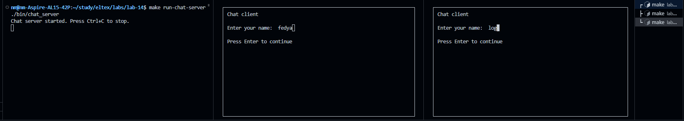
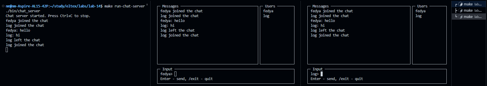
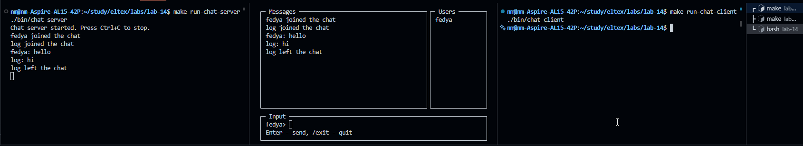

# 14 - Разделяемая память

## Задание
1) Реализовать 2 программы, первая сервер, вторая клиент. Сервер создает
сегмент разделяемой памяти (достаточный для хранения сообщений) и
записывает сообщение в виде строки `Hi!`, ждет ответа от клиента и
выводит его на экран, удаляет сегмент разделяемой памяти. Клиент
подключается к сегменту разделяемой памяти и считывает сообщение от
сервера, выводит на экран, отвечает серверу сообщением `Hello!`.
Сделать это как для POSIX, так и для SYSTEM V стандартов.

2) Написать 2 программы, первая сервер, вторая клиент. Сервер создает
сегмент разделяемой памяти для реализации чата с общей комнатой и
его задача уведомлять клиентов о появлении новых участников, о новых
сообщениях. Клиент подключается к сегменту разделяемой памяти,
созданному сервером, сообщает ему свое имя и получает в ответ все
сообщения в комнате. Далее может отправлять сообщения в общий чат.
Получение служебных сообщений от сервера и отправка сообщений в чат
реализованы в разных потоках. Интерфейс клиента реализован с помощью
библиотеки `ncurses`.

## Структура проекта

```text
lab-14/
├── include/
│   ├── chat.h       # Общие структуры для shared memory
│   └── chat_ui.h    # Интерфейс ncurses-части клиента
├── src/
│   ├── posix_server.c
│   ├── posix_client.c
│   ├── sysv_server.c
│   ├── sysv_client.c
│   ├── chat_server.c
│   ├── chat_client.c
│   └── chat_ui.c
└── Makefile
```

## Сборка

Собрать все программы:

```bash
make
```

Очистить бинарные файлы:

```bash
make clean
```

## Запуск

### 1 задание

POSIX shared memory:

```bash
make run-posix-server
make run-posix-client
```

System V shared memory:

```bash
make run-sysv-server
make run-sysv-client
```

### 2 задание

Сначала запускается сервер чата:

```bash
make run-chat-server
```

Потом в одном или нескольких отдельных терминалах запускаются клиенты:

```bash
make run-chat-client
```

Выход из клиента:

```text
/exit
```

## Как сделано 1 задание

### POSIX

- используется объект POSIX shared memory;
- данные хранятся в общей структуре `PosixExchangeMemory`, которая лежит в shared memory;
- сервер создает shared memory, отображает её через `mmap` и записывает `Hi!`;
- для синхронизации сервера и клиента используются два `sem_t` внутри общей памяти;
- клиент ждёт сообщение сервера, читает `Hi!`, пишет `Hello!` и будит сервер;
- сервер читает ответ клиента, после чего освобождает ресурсы.

### System V

- используется один сегмент System V shared memory;
- данные хранятся в общей структуре `SysvExchangeMemory`, подключённой через `shmat`;
- сервер создает сегмент и записывает `Hi!`;
- клиент подключается к сегменту, читает сообщение и записывает `Hello!`;
- синхронизация сделана через System V semaphores;
- после обмена сервер удаляет сегмент.

Кратко по синхронизации:

- в POSIX защита сделана через семафоры, поэтому доступ к данным идёт в правильном порядке;
- в System V тоже используются семафоры, только через API `semget/semop/semctl`.

## Как реализовано 2 задание

Во 2 задании реализован общий чат на POSIX shared memory.

Кратко по логике:

- сервер создаёт общий сегмент shared memory для всей комнаты;
- в общей памяти хранятся:
  - список пользователей;
  - история сообщений;
  - очередь команд от клиентов;
- клиент после запуска вводит имя и подключается к общей памяти;
- клиент отправляет команды `JOIN`, `TEXT`, `LEAVE` в очередь команд внутри shared memory;
- сервер в основном цикле читает эти команды, обновляет комнату и добавляет новые сообщения;
- клиент в отдельном потоке периодически читает актуальное состояние комнаты из shared memory;
- основной поток клиента отвечает только за интерфейс и ввод.

Как происходит обмен:

- клиент сначала кладёт команду в FIFO-очередь команд внутри `ChatRoom`;
- сервер берёт команды по одной в порядке поступления;
- после обработки сервер обновляет общий список пользователей и историю сообщений;
- клиенты видят изменение версии комнаты и копируют уже готовое состояние в свой интерфейс.

Почему это удобно:

- все данные комнаты лежат в одном месте;
- сервер остаётся главным обработчиком событий;
- клиентам не нужно разбирать служебные строки;
- список пользователей и сообщения просто копируются из общей памяти.

## Интерфейс клиента

Клиентский интерфейс разделён на 3 области:

- слева окно сообщений;
- справа список пользователей;
- снизу поле ввода сообщения.

Файлы разделены так:

- `chat_ui.c` отвечает только за отрисовку интерфейса;
- `chat_client.c` отвечает за логику клиента и чтение состояния комнаты;
- `chat_server.c` отвечает за обработку команд и обновление общей комнаты.

## Пример работы

### 1 задание

POSIX:

```text
Terminal 1:
$ make run-posix-server
Client message: Hello!

Terminal 2:
$ make run-posix-client
Server message: Hi!
```

System V:

```text
Terminal 1:
$ make run-sysv-server
Client message: Hello!

Terminal 2:
$ make run-sysv-client
Server message: Hi!
```

### 2 задание

Пример работы сервера:

```text
$ make run-chat-server
Chat server started. Press Ctrl+C to stop.
fedya joined the chat
log joined the chat
fedya: hello
log: hi
log left the chat
log joined the chat
fedya left the chat
log left the chat
```

Пример сценария клиентов:

```text
Client 1:
- ввод имени: fedya
- отправка сообщения: hello
- выход: /exit

Client 2:
- ввод имени: log
- получение сообщения от fedya
- отправка ответа: hi
- выход: /exit
```

## Скриншоты




